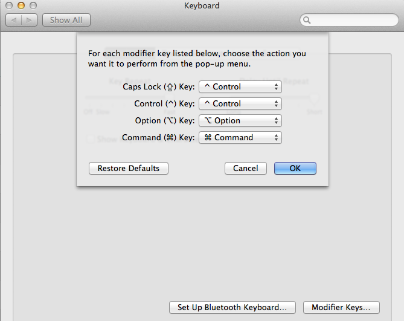
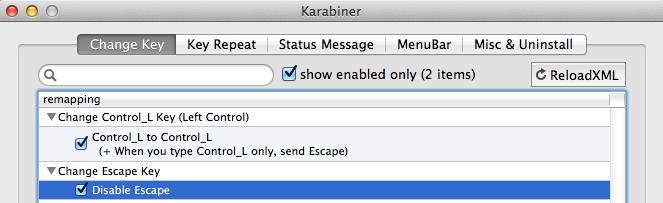

## Installation

Repo contents go inside of `~/.vim/`. Pathogen packages are referenced as submodules.

```
git clone --recursive https://github.com/BrandonClapp/vim-environment ~/.vim/
```

`~/.vimrc` is now located at `~/.vim/.vimrc` so a syslink is required.


```
ln -s ~/.vim/.vimrc ~/.vimrc
```

## Included plugins
- auto-pairs
- ctrlp
- nerdtree
- syntastic
- vim-airline
- vim-colorschemes
- vim-surround
- omnisharp-vim
- vim-dispatch
- YouCompleteMe
- ultisnips

## Rebinding keys

Caps Lock can be rebound to Left Control when held, Escape when tapped.

### Mac/Linux

Karabiner/xcape can be used. [Follow instructions here](http://www.economyofeffort.com/2014/08/11/beyond-ctrl-remap-make-that-caps-lock-key-useful/)

*Bind Capslock to Control*



**Karabiner**

Install with `brew install karabiner`

*Send `Escape` when `Control` is pressed*



### Windows

Rebind Caps Lock key to Control when held, Escape when tapped.

**AutoHotKey Script:**

```
; Author: fwompner gmail com
#InstallKeybdHook
SetCapsLockState, alwaysoff
Capslock::
Send {LControl Down}
KeyWait, CapsLock
Send {LControl Up}
if ( A_PriorKey = "CapsLock" )
{
    Send {Esc}
}
return
```

## OmniSharp

Requirements:
- Mono >3

OmniSharp needs to be compiled before use. After the environment has been cloned/pulled and `git submodule update --init --recursive` has been performed, use xuild/msbuild to build the omnisharp server.

```bash
cd omnisharp-vim
git submodule update --init --recursive
cd server
xbuild
```
Change xbuild to msbuild if working on Windows.

### Roslyn server (for asp.net core)

Note: yet to get this working.

Additionally, if using the `omnisharp-roslyn` (for asp.net core) server, it can be built and used instead (still requires mono for building)

```bash
cd ./.vim/bundles/omnisharp-vim/omnisharp-roslyn/
./build.sh
```

Then adding the following to `.vimrc` to tell vim to tell `omnisharp-vim` to launch the roslyn server instead of the traditional one. (Already included in `.vimrc` in this repo)

```bash
let g:OmniSharp_server_type = 'v1'
let g:OmniSharp_server_type = 'roslyn'
```
